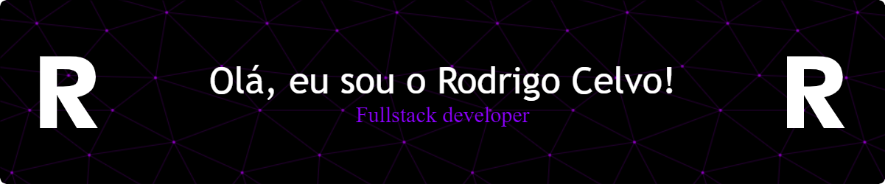

##

 

- 🌱  I’m always studying **JavaScript, ReactJS, React Native, NodeJS, TypeScript**

- 🚀  How to reach me  [rodrigocelvo.dev](https://rodrigocelvo.dev)

 

## 🛠 &nbsp;Tech Stack

&nbsp;
&nbsp;
&nbsp;
&nbsp;
&nbsp;
&nbsp;
&nbsp;
&nbsp;
&nbsp;

 

## ⚙️ &nbsp;GitHub Analytics
 

